# JIO-hybrid-STB-JHS-D200-v2--LINUX
as name suggests, I will try to put a linux distribution, like armbian(debian) into the old DDR3 jio hybrid STB from 2019.

setup used for this project on the stb:

DELL Latitude 7280 21.5" (intel core i5 6300U "skylake U/Y" + 8gb DDR4(2133 mhz) + M.2 Serial ATA{SATA} SSD 240gb): Main programmer, used to make this git page, runs win10pro

Samsung Galaxy A21s{SM A217F, esynos 850 : cortex A55 efiiciency cores, ARM Mali-G52 MC1(single core), 4+64gb}(yes i am poor): Photography(as shown in the watermark of each image), progress update in the r/linuxusersindia community, which incouraged me into taking this project seriously, runs Android 12

Acer Spin 1{SP111-31, Intel Pentium N4200 "goldmont"/"Applo Lake" + 8gb DDR3(1600 mhz) + Serial ATA{SATA} SSD 120gb}: also for browing reddit and relpying because its too weak, but it runs debian trixie :D(ik i could have not mentioned this)

Random Chinese company Bootleg MEGA 2650 + ESP 8226 + Wifi + usb micro chip i got off 8k on amazon(image will be there later on): USB to UART transalator... i know its a wase of money rn, but i have played bad apple on it, so its not a big waste of money...

(instructions to open found later, idk why i did that, sorry)

====

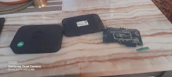

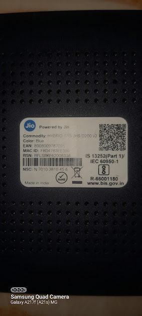

the device used^^

(reads HYBRID STB JHS D200 v2 on second image)

====

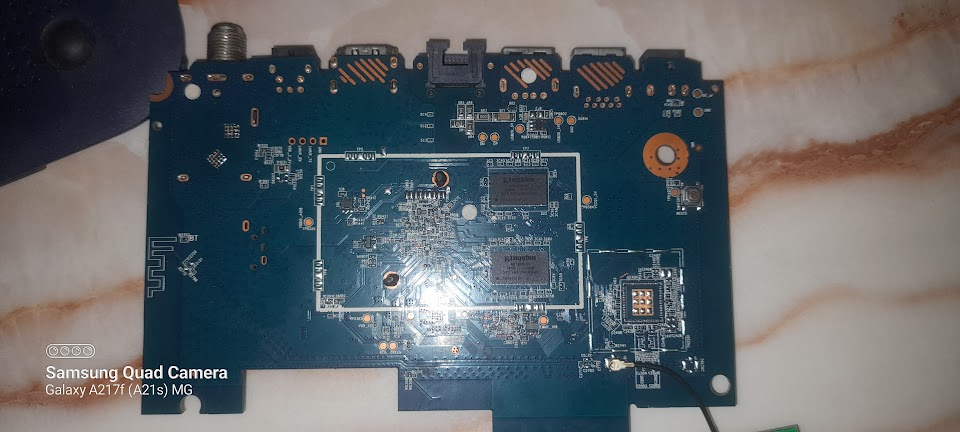

^the "back" of the motherboard^

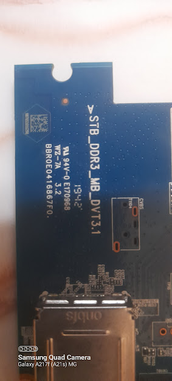

^name of the mb printed on the **front side**^

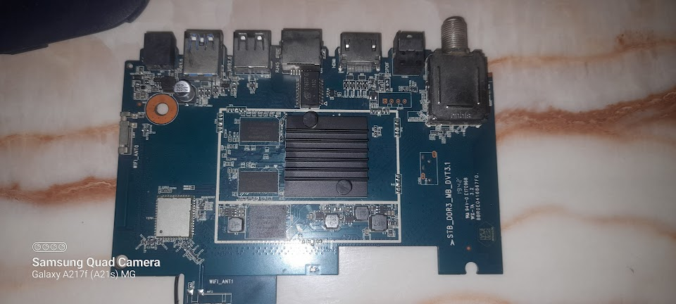

^the front side, aka the cpu side^ 

(cpu under the heatsink)

====

also, important point, after openi-

oh...

right, ***how to open the case?***

use a small flathead scredriver to open up the rubber tips a the bottom, then use a fat crosshead screw to open up the screws (there will be 3, each corner except one, the "dish/antennae in" side(lets call it west, to remove confusion, yes?) at the back... takes quite the strength, but ill say to reserve it, because we have got clips, which can hold up your weight, there is a slot on the other side of the antennae port side to aid you(east side), use a big flathead screwdriver to pry it open, put finger in the gap at your own risk, but it will help, get the other clips off, the clips are absent on the ports side, and there is only one clip present on the slot side, and there are 2 at the front/led/south side, one on west side, one on the northwest corner, and one on the southeast corner... after htis tireing torture, and a case with dents, we now have to unscrew the mb, BUT WAIT, unscrew the pcb antennae forst witha small cross head screw, then use a big crosshead, which you used for the case, to unscrew the MB...

now, back to the important point, the cpu heatsink is bad at its job, so do this processes if you have thermal paste/putty/pad at your home, i had thermal paste, i used that, by taking off a sticky sheet  on the heatsink, and then put thermal paste on the amlogic cpu(see below)... this makes it throttle less under load

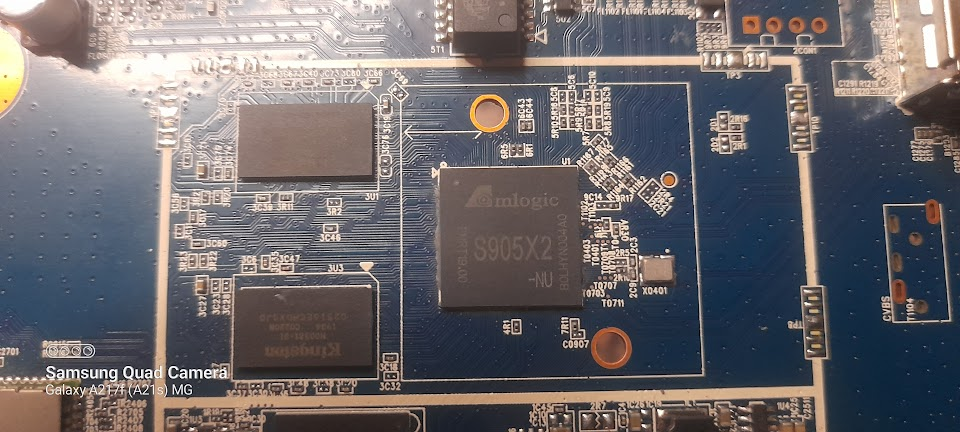

^^Amlogic S905X2 -NU cpu,

4 core cortex A53, FinFET architechture, 12nm processes, 1.8 ghz
(the redmi note 4 "mido" 

(not nickel, nickel was a overheating decacore mediatek cpu, china only variant, came before mido), 

was also a arm cortex A53 cpu, also with a FinFET architecture, but octacore, and 14nm processes, making it less efiicient(larger processes), but more powerful(more cores) at 2ghz)

the amlogic also has a ARM Mali-G31 MP2 (Dual-core, supports OpenGL ES 3.2, Vulkan 1.1, and handles the UI rendering effortlessly)

this was the soc, ready for the ram? well, you can see 2 out of the 4 ram chips, on the motherboard... lets zoom in, shall we?

(ohno, i didnt rotate it... sorry)

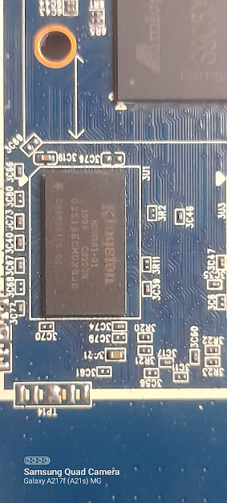

^^img of 1

RAM: 2GB DDR3 SDRAM

Configured via 4x physical Kingston D2516ECMDXGJD modules (512MB each, split with two on the top layer and two stacked directly underneath on the bottom layer)

and the storage? lets pan the camera:

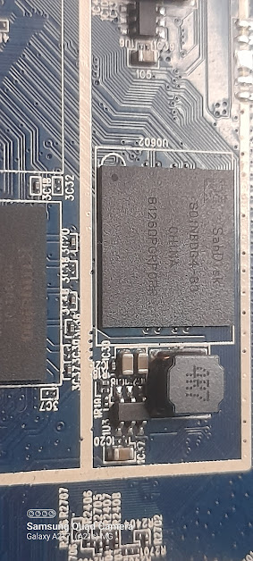

^^8GB eMMC 5.1 Flash

Managed by the single physical SanDisk SDINBDG4-8G module
jio uses 4 for you, and 4 reserved for the system... tho, only 5 gb will be reserved for us, AS FREE SPACE! only if a stripped down Debian system is written... great... and the gui will take more... god its best if we do usb boot... il see to it later...

====

***well, what's that silver thing beside them?***

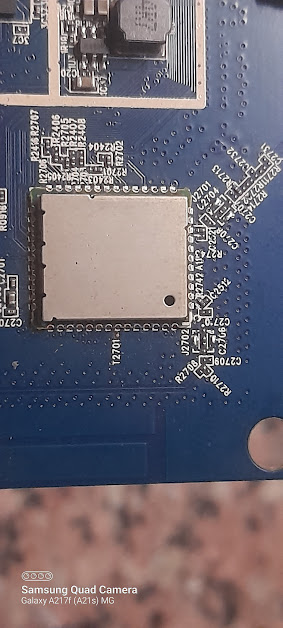

oh, well, that my friend, is the wifi chip!

Wi-Fi Module: Onboard Ampak/Realtek combo module under the physical metal EMI shield.

Dual-Band 2x2 MIMO

2.4 GHz: 802.11b/g/n

5.0 GHz: 802.11n/ac

Bluetooth: Dual-stack Bluetooth 4.0 + BLE (Bluetooth Low Energy). This handles the stock voice-search remote connection.

***and what about that ethernet port?***

Wired Ethernet: 10/100 Mbps Fast Ethernet (RJ-45 port handled by a native Amlogic internal MAC layer).

====

***and, how about we see the back side?***

sure, there ya go

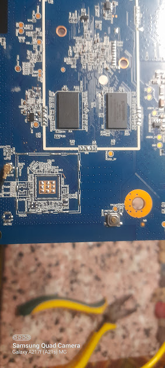

we can see the other two ram modules, and oh, what is that 3x3 arrangement of solder blobs?

well that works as a heatsink! its connected directly to them copper traces inside, cuz in that protective layer, they sure will get hot...

=====

now, for the grand finale, what's the great thing i found?

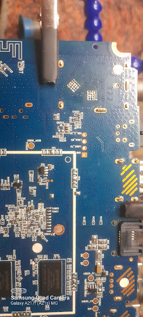

^^see those four copper pads, empty? they are labeled on the back side, but not on the front, and, the label has GND, LINUX_TX, LINUX_RX, VCC 3.3 v

well, the rx and tx are a UART interface!!
so, by using that bootleg arduino i have, i can use it to read whaever serial output the little guy gives, AND, write code to this guy!

====

so, what setup does this guy have? well, here ya go!

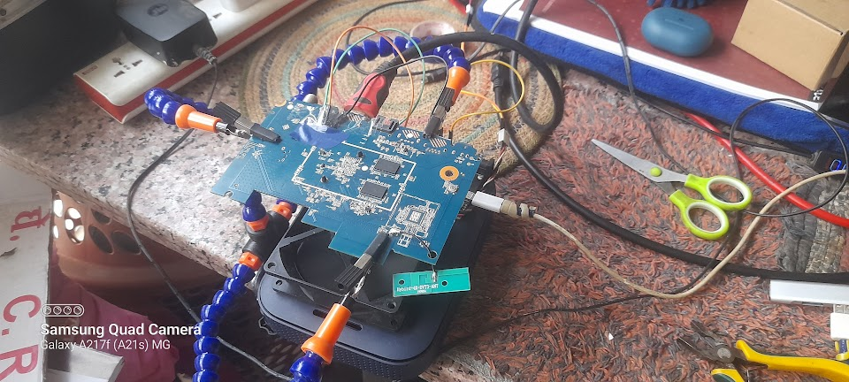

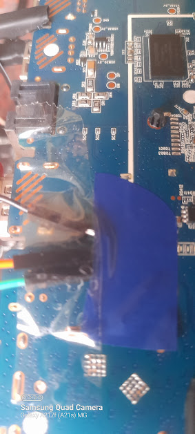
|**IMPORTANT**|

as you can see, there are 3 pins connected to that 4 pin uart interface, that is because i didnt connect the 3.3v pwr pon, so that my mega does not emit the magic blue smoke(which is bad)... i conncted the LINUX_TX to pin 1(TX) on my mega, amd connected LINUX_RX to pin 0(RX)... and GND to GND, to have a common grounding...

rest of the images:

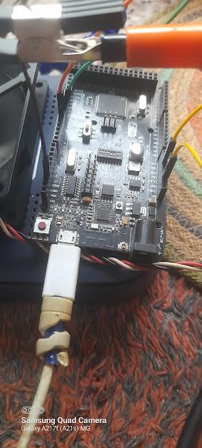

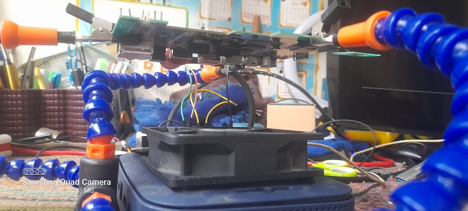

^^the fan there is a 12v case fan, capable of 8k to 9k rpm, but is running off of 5v, so its pretty quiet, ***why?*** because is is on the veranda, and that gets pretty hot... so does the main board get hot after prolonged usage, this keeps it from throlling (cpu is below, you might be able to see the heatsink, did a fresh repaste after i took that image...)

and, below, is the image of the setup in evening lighting...

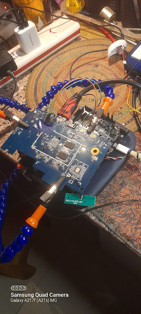

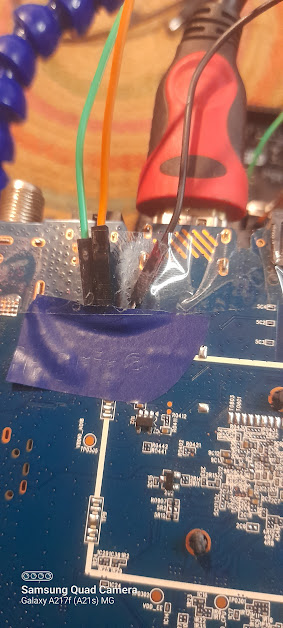

====

now, is the end of updates for the day of 28th of may, '26.

project started on 27th of may, '26

i hope you guys can wait patiently, as i will see what output do i get from the UART, after i turn on the tv and plug in the barrel apadper... that's something for... perhaps tommorow, or maybe later this night...

thank you, u/Careful_Detective189, to share the post of u/Arcade_30 on r/Jio, on r/LinuxUsersIndia, to make me start this project...
i am a single man dev, 10th grader of cbcse board in india... i have responsibilaties, which make it so that i cannot fully commit, even if i wholeheartedly wanted to... so, please keep patience, as i like to spend my free time, and night sleep hours(i sleep in the afternon too, so its fine), on this projects, and the project between a team of my allen classmates(i am the chief designer and cheif programmer)...

====
